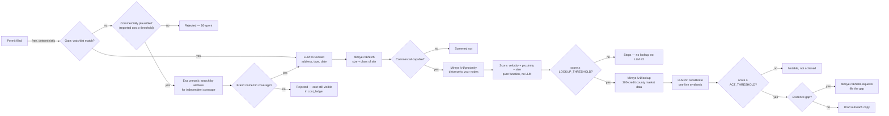

# Expansion Radar

**An agent that finds accounts before your competitor's sales rep does.**

Built for the Mireye Build Challenge. Watches real commercial building-permit
filings for physical-world expansion signals from a small hardcoded
watchlist of DTC/retail brands, enriches matched signals with cited Mireye
facts, scores buyer intent deterministically, and — above a threshold —
**acts**: drafts outreach copy or files a Mireye field request to close an
evidence gap. Not a dashboard. It reasons, decides, and acts.

## The pipeline



Every stage after the free gate costs something — an LLM call, Mireye
credits, or both — so cheap checks run first and expensive ones only run on
survivors of the previous threshold. Every early exit is visible in
`cost_ledger.escalation_stopped_at`, not just claimed.

## Why this is different

ZoomInfo, Bombora, and similar tools track what a company **says** — funding
rounds, job posts, press releases. Expansion Radar tracks what a company
**does** in the physical world: a permit filed, a building actually sized
and located, cross-validated against cited facts. It's a different evidence
category, not another layer on the same one everyone already sells.

**Who pays:** the growth/partnerships lead at a flexible-warehousing or
fulfillment network (a Flexe/Stord-shaped buyer). They already budget for
sales intelligence — they don't yet have one that reads physical-world
execution instead of digital chatter.

**What we combined Mireye with:** real municipal building-permit filings
(Chicago's open-data portal — public, no auth) as the primary physical-world
signal, resolved and sized through three tiers of Mireye: `/v1/fetch`,
`/v1/proximity`, and `/v1/lookup`, then closed out through
`/v1/field-requests` when the evidence is incomplete.

The "weird" part isn't just reading permits — permit databases are on
Mireye's own example list. It's that a lot of the interesting permits are
filed under a contractor or property-LLC name, not the retail brand, so a
naive text-match gate rejects exactly the signals that matter most. When the
free gate misses a commercially plausible permit (reported cost above a
threshold — see `UNMASK_MIN_REPORTED_COST` in
[`src/score/thresholds.ts`](src/score/thresholds.ts)), the pipeline spends
one Exa call searching by the permit's address for independent news coverage
naming the real brand, then runs that coverage through the exact same
matcher the free gate uses. This is a genuine second gate tier, not
corroboration of an already-known brand — see `unmaskBrand` in
[`src/sources/exa.ts`](src/sources/exa.ts). It's the one place in the
pipeline a "rejected" event can still carry nonzero cost, and that cost is
always visible in `cost_ledger`.

### Real example: unmasking a shell-filed permit

A live run (not a fixture, not simulated) against a real Chicago permit:

> **Permit id `2076846`**, 930 N Rush St, Chicago — filed 2009-08-25, real
> cost **$500,000**. Full permit text: *"FIRST-TIME BUILDOUT OF ATHLETIC
> CLOTHING RETAIL STORE."* No brand name anywhere in the description or the
> 7 listed contacts (`KURZMAN RANDALL P`, `RIPEC ELECTRIC`, `CRANE
> CONSTRUCTION COMPANY, L.L.C.`, …). The free gate correctly rejects it —
> nothing in the text matches the watchlist.
>
> `unmaskBrand` spent one live Exa call and correctly resolved it to
> **lululemon**, citing three real, independent articles:
> - [chicagotribune.com — "lululemon's Gold Coast store to nearly double in size as it becomes flagship"](https://www.chicagotribune.com/2017/05/01/lululemons-gold-coast-store-to-nearly-double-in-size-as-it-becomes-flagship/)
> - [rejournals.com — "Colliers International Chicago announces sale of lululemon athletica store"](https://rejournals.com/colliers-international-chicago-announces-sale-of-lululemon-athletica-store/)
> - [chicagomag.com](https://www.chicagomag.com/style-shopping/November-2017/This-Wicker-Park-Pop-Up-Shop-Is-the-Stuff-of-Sneakerhead-Dreams/)

Recorded at [`fixtures/exa/unmask-ee5adc48bb86f3e5.json`](fixtures/exa/unmask-ee5adc48bb86f3e5.json). This is cited as standalone evidence of the capability rather than folded into the 5-event demo set below, since making it a full 6th replayable event would mean spending the remaining Mireye tiers (`/v1/fetch`, `/v1/proximity`, possibly the 300-credit `/v1/lookup`) live just for demo polish.

## Proof, not a pitch

One real run, five real Chicago permits (real addresses, real dollar values,
real 2025–2026 issue dates — nothing synthetic):

| Account | Signal | Buyer intent | Action | Mireye credits |
|---|---|---:|---|---:|
| Old Navy | $247K interior buildout permit | high (0.910) | **outreach_draft** | 340 |
| Trader Joe's | $700K shell buildout, "TRADER JOES" (fuzzy match, no apostrophe) | high (0.726) | **field_request** (real `/v1/field-requests` call — see below) | 340 |
| Five Below | "coming soon, now hiring" banner permit | medium (0.671) | none — stopped below `LOOKUP_THRESHOLD` | 40 |
| lululemon | Storefront sign permit | high (0.809) | **outreach_draft** | 340 |
| *(unrelated residential porch permit)* | — | — | rejected at gate | **0** |

**Run total:** 4 matched / 1 correctly rejected, 9 LLM calls, 1,060 Mireye
credits, $0.028 Exa cost. Two independent `npm run pipeline` runs produce
**byte-identical output** — verified with a diff, not asserted.

A field request from this exact pipeline was filed live against Mireye and
returned a real response:

```json
{
  "request_id": "fr_49aee4bfc5594f578c4351a4f61756e1",
  "status": "awaiting_confirm",
  "disposition": [
    { "field_id": "county_employment_total", "disposition": "near_miss_confirm" },
    { "field_id": "parcel_id", "disposition": "near_miss_confirm" }
  ]
}
```

The demo defaults to `--dry-run` on field requests (GROWTH plan allows only
3/month) — this response proves the live path is real, not dead code.

## Sample output

One event from an actual `npm run pipeline` run, matching the fixed
`PipelineOutput` schema in [`src/schemas/index.ts`](src/schemas/index.ts):

```
account:              Old Navy
gate_status:          matched
signal:               Permit 101081799 at 1730 W FULLERTON AVE, Chicago, IL. INTERIOR RENOVATION...
synthesis:            This account matters right now because Old Navy is undertaking a 13,333 sq ft
                       interior renovation just 13 minutes from Node - Goose Island, even as county
                       building permits have fallen 23.6% YoY.
mireye_facts_summary: 13,333 sq ft building footprint (retail), 13 min from Node - Goose Island,
                       county building permits down 23.6% YoY, home prices up 5.2% YoY
buyer_intent:         high (confidence 0.910)
action_taken:         outreach_draft
  detail:             I noticed Old Navy is moving forward with a 13,333 sq ft retail building
                       footprint renovation, located just 13 minutes from our Goose Island facility...
llm_calls_made:       3
cost_ledger:          340 mireye credits [/v1/fetch, /v1/proximity, /v1/lookup], $0.0070 exa,
                       stopped_at=completed
```

## Cost discipline

Weights, thresholds, and Mireye credit costs live in exactly one place:
[`src/score/thresholds.ts`](src/score/thresholds.ts) — no inline magic
numbers anywhere else in the codebase.

| Stage | Cost | Gated by |
|---|---|---|
| Gate (watchlist match) | $0, 0 credits | every incoming permit |
| Exa unmask (2nd-tier gate) | 1 Exa call, ~$0.007 | only gate-misses with reported cost ≥ `UNMASK_MIN_REPORTED_COST` |
| Exa resolve + LLM #1 extract | 1 LLM call, ~$0.007 | survivors of the gate (reuses the unmask call's Exa spend if it already ran) |
| `/v1/fetch` (size + class) | 4 credits | every matched, located event |
| `/v1/proximity` (distance to your nodes) | 36 credits | every commercial-capable event |
| `/v1/lookup` (county market data) | **300 credits** | only events scoring ≥ `LOOKUP_THRESHOLD` (`ACT_THRESHOLD`, 0.7) |
| LLM #2 recalibrate + act | 1–2 LLM calls | only events scoring ≥ `ACT_THRESHOLD` (0.7) |

`/v1/lookup` is deliberately the last and rarest call — it's 75x the cost
of `/v1/fetch` for a bounded ±0.10 score refinement, so it only runs once a
candidate is already act-capable on the cheap velocity/proximity/size screen.

LLM cost is tracked the same way: `cost_ledger` carries real, provider-
reported `llm_input_tokens`/`llm_output_tokens` plus an approximate
`llm_cost_dollars` estimate, captured only on an actual live call — a
replayed fixture correctly reports usage as unavailable rather than
fabricating a number (the demo set's fixtures predate this tracking; run
live with `RECORD=1` to see real per-call numbers).

## Setup & running it — no API keys required

This is the whole verification path for a reviewer with no keys and no
Mireye/Exa/LLM accounts. Every call replays from the fixtures checked into
`/fixtures` — zero network calls, zero live spend, fully deterministic:

```bash
git clone https://github.com/saurabhjambure-pixel/Mireye-Watcher-Agent.git
cd Mireye-Watcher-Agent
npm install
npm test           # 23 tests — zero network, zero API keys
npm run pipeline    # 5 real Chicago permits, replayed — zero network, zero API keys
```

Run `npm run pipeline` a second time and diff the output against the first
— it's byte-identical, which is the determinism claim proven, not asserted.

The real live-unmask evidence in this README (`fixtures/exa/unmask-ee5adc48bb86f3e5.json`)
is also just a checked-in file — open it directly, no run required. The
citations inside it (Chicago Tribune, REjournals) are real, independently
checkable URLs.

### Live mode (optional — needs your own API keys)

```bash
cp .env.example .env   # MIREYE_API_KEY (sign up at mireye.com, code GROWTH), EXA_API_KEY, LLM_PROVIDER_API_KEY
RECORD=1 npm run pipeline                         # hits real APIs, records new fixtures
RECORD=1 npm run pipeline -- --live-field-request  # also files a real /v1/field-requests call
npm run pipeline -- --quiet                        # suppress the raw Mireye JSON dump
RECORD=1 npm run pipeline -- --discover            # agent finds its own matches from live permits,
                                                    # instead of the 5 fixed demo IDs — see src/run.ts
```

Field requests default to dry-run/validate-only even in live mode — the
GROWTH plan allows 3/month, and repeat/demo runs reuse the same
`idempotency_key` instead of filing twice.

## Testing

`npm test` (23 tests: gate, score, cassette versioning, pipeline failure
isolation, the unmask tier) and `npm run pipeline` (above) are the main
proof points. Two more, for completeness:

```bash
npm run typecheck # tsc --noEmit
npm run build     # full build to dist/
```

## Non-goals

No live web scraping beyond the two documented public/no-auth APIs (Chicago
permits, Exa). No database, no persistence beyond `/fixtures` cassettes, no
auth, no multi-user support, no UI framework. No generalization beyond this
one vertical — DTC retail expansion signal → fulfillment network buyer. No
dependency on any other repo.

## Feedback for Mireye

`/v1/lookup` is the single worst cost-to-signal call in this pipeline: 300
credits versus 4 for `/v1/fetch`, and it now consumes 900 of the run's 1,060
total credits for a measured score effect of about -0.04 (the same
county-level trend repeats across nearby addresses). Swapping it for a
targeted `/v1/ask` query over just the fields this pipeline actually uses
(`building_permits_yoy_pct`, `hpi_yoy_pct`, `population_growth_1yr_pct`)
would cost an estimated 10 credits instead of 300 — an 86.5% reduction —
if `/v1/ask` can return equivalent structured, cited values. Separately, a
native "recent commercial lease/permit activity at this parcel" field would
let an agent like this skip the external municipal-portal step entirely and
get both the signal and the enrichment from Mireye directly.
