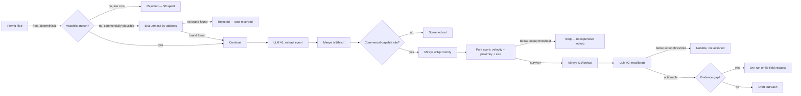

# Expansion Radar

**An agent that finds physical-world expansion signals before a competitor's
sales rep does.**

Expansion Radar turns commercial building-permit activity into a ranked,
evidence-backed sales signal for a fulfillment or flexible-warehousing team.
It combines a deterministic watchlist gate, independent brand resolution,
Mireye site facts, pure scoring logic, and narrowly scoped LLM steps. When the
evidence is strong enough, it acts by drafting outreach or requesting the
missing evidence. This is a small, runnable demonstration of product thinking,
AI orchestration, cost-aware systems design, and pragmatic “vibe coding” with
clear boundaries around what the model is allowed to decide.

## About the author

I’m Saurabh Jambure, a product-minded builder who enjoys turning ambiguous
business problems into focused, testable software. I use AI as a force
multiplier for research, implementation, and iteration, while keeping the
important product decisions explicit: who the user is, what evidence earns an
action, how failure is surfaced, and what each external call costs. This repo
is meant to show that combination of product judgment, applied AI, and hands-on
engineering rather than present a polished UI around an opaque model call.

## Why this exists

Sales-intelligence tools often observe what a company says: funding, hiring,
press releases, or job posts. Expansion Radar observes what a company does in
the physical world: a permit is filed, a site is located and sized, and the
signal is cross-checked against cited facts.

The target user is a growth or partnerships lead at a fulfillment or
flexible-warehousing network. They already understand sales intelligence; the
product question is whether a physical expansion signal is strong enough to
deserve a conversation now.

## The pipeline



Every paid or quota-bearing stage is behind a cheaper gate. Each event returns
a `cost_ledger` with the calls made and the stage where escalation stopped, so
the system makes its cost and uncertainty visible instead of hiding them
behind a final score.

## What it demonstrates

- **Product thinking:** a specific buyer, a specific signal, explicit
  non-goals, and an action threshold rather than a generic “AI monitor.”
- **Applied AI:** LLMs extract structured event data, recalibrate a bounded
  score, and draft outreach; deterministic code owns gating, scoring, and
  safety-critical branching.
- **Agent behavior:** the pipeline decides whether to continue, stop, spend,
  or ask for more evidence instead of calling every tool for every event.
- **Engineering judgment:** replayable cassettes make the demo deterministic,
  typed API wrappers surface failures, and idempotency protects field-request
  retries.
- **Evidence quality:** every enriched fact carries source metadata, and a
  parcel area is never silently presented as a tenant's building footprint.

## What makes the signal unusual

The primary signal is a real municipal permit, not a press article. Interesting
permits are often filed under a contractor or property LLC rather than the
retail brand. When the free gate misses a commercially plausible permit, the
pipeline spends one Exa search on the permit address, then runs the returned
coverage through the same watchlist matcher. That second-tier unmasking step
can recover a brand without turning press coverage into the primary signal.

The demo includes a recorded example of a shell-filed permit that was resolved
to lululemon through independent coverage:

- [Chicago Tribune — lululemon Gold Coast expansion](https://www.chicagotribune.com/2017/05/01/lululemons-gold-coast-store-to-nearly-double-in-size-as-it-becomes-flagship/)
- [REjournals — lululemon store transaction](https://rejournals.com/colliers-international-chicago-announces-sale-of-lululemon-athletica-store/)
- [Recorded Exa response](fixtures/exa/unmask-ee5adc48bb86f3e5.json)

## Run the demo with no API keys

Requirements: Node.js 20 or newer.

```bash
git clone https://github.com/saurabhjambure-pixel/Mireye-Watcher-Agent.git
cd Mireye-Watcher-Agent
npm install
npm run verify
npm run pipeline
```

The default mode replays checked-in fixtures. It makes no network calls to
Mireye, Exa, or the LLM provider, spends nothing, and produces the same result
on repeat runs. The fixture set contains five real Chicago permit records:
four matched signals and one unrelated residential permit rejected at the
free gate.

To check determinism yourself:

```bash
npm run pipeline > /tmp/expansion-radar-run-1.txt
npm run pipeline > /tmp/expansion-radar-run-2.txt
diff -u /tmp/expansion-radar-run-1.txt /tmp/expansion-radar-run-2.txt
```

The tests cover gate matching, fuzzy matching, scoring thresholds, cassette
versioning, per-event failure isolation, and the Exa unmasking tier.

## Use live providers (optional)

Live mode requires your own provider accounts and API keys:

```bash
cp .env.example .env
# Fill in MIREYE_API_KEY, EXA_API_KEY, and LLM_PROVIDER_API_KEY in .env.

RECORD=1 npm run pipeline
RECORD=1 npm run pipeline -- --discover
```

`RECORD=1` sends real requests and writes their responses to `fixtures/`.
Review every new recording before committing it. The normal field-request
path is validation-only/dry-run, which protects Mireye's monthly quota. Only
use this explicit command when you intend to make an external write:

```bash
RECORD=1 npm run pipeline -- --live-field-request
```

Other useful options:

```bash
npm run pipeline -- --quiet
RECORD=1 npm run pipeline -- --discover --discover-days=7 --discover-limit=50
```

See [`.env.example`](.env.example) for the complete configuration surface and
[`SECURITY.md`](SECURITY.md) before using live mode.

## Cost-aware escalation

Thresholds, weights, and Mireye credit costs live in
[`src/score/thresholds.ts`](src/score/thresholds.ts). The current design keeps
the most expensive call last:

| Stage | Cost | Runs when |
| --- | ---: | --- |
| Deterministic gate | $0 | Every permit |
| Exa unmask | About $0.007 | A gate miss looks commercially plausible |
| LLM extraction | Provider cost | A brand survives the gate |
| Mireye `/v1/fetch` | 4 credits | A matched event has a location |
| Mireye `/v1/proximity` | 36 credits for three nodes | The site is commercial-capable |
| Mireye `/v1/lookup` | 300 credits | The cheap score clears `LOOKUP_THRESHOLD` |
| Recalibration and action | Provider cost | The lookup survivor is action-capable |

The ledger also records provider-reported LLM token usage when running live.
Replayed fixtures recorded before usage tracking report unavailable cost rather
than inventing a number.

## Repository map

```text
src/
  gate/          deterministic watchlist matching
  score/         weights, thresholds, and pure scoring functions
  pipeline.ts    tiered orchestration and failure isolation
  mireye/       typed Mireye endpoint wrappers
  sources/       Chicago permits and Exa resolution
  extract/       LLM event extraction
  recalibrate/   bounded LLM score refinement
  act/           outreach draft and field-request actions
  cassette.ts    record/replay boundary for every external call
fixtures/        committed replay data for the offline demo
demo-data/       watchlist, reference nodes, and demo permit IDs
```

## Testing and contribution

```bash
npm test
npm run typecheck
npm run build
npm run verify       # all three commands above
```

See [`CONTRIBUTING.md`](CONTRIBUTING.md) for the review checklist and
[`AUDIT_REPORT.md`](AUDIT_REPORT.md) for historical implementation notes and
trade-offs discovered while building against live APIs.

## Scope and limitations

This is a focused CLI demonstration, not a production monitoring service. It
does not include a database, authentication, multi-user support, a UI, or a
general-purpose crawler. It currently targets DTC/retail expansion signals for
a fulfillment-network buyer and uses Chicago permit data as its municipal
source.

The checked-in permit and provider fixtures are intended for reproducible
demonstration. They may contain public addresses, company names, citations,
and provider response metadata; review them before adding new recordings or
repurposing the pipeline for a different data source.

## License

Released under the [MIT License](LICENSE).
